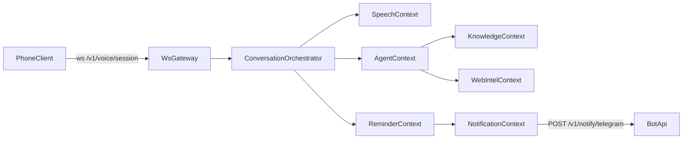

# План реализации HubaHome_Server (Full MVP)

## Цель
Собрать `HubaHome_Server` как production-like MVP: от каркаса репозитория и контрактов до стабильного end-to-end потока (voice -> orchestration -> tools -> response), персистентных напоминаний и базового hardening.

Опора на контекст: [D:\files\projects\HubaHome\HubaHome_Project_Context.md](D:\files\projects\HubaHome\HubaHome_Project_Context.md).

## Архитектурный каркас (что фиксируем сразу)
- Слои и направленность зависимостей: `interfaces -> application -> domain`, `infrastructure` подключается через порты.
- Bounded contexts в `src/`: `conversation`, `agent`, `knowledge`, `webintel`, `reminder`, `notification`, `speech`.
- Основные внешние контракты:
  - WebSocket: `/v1/voice/session`.
  - Сервисные REST endpoint'ы: `/health`, `/config`, `/diagnostics`.
  - Notification outbound: `POST /v1/notify/telegram`.

## Пошаговый план по фазам

### Phase 1 — Skeleton и базовая инфраструктура
1. Создать структуру репозитория `HubaHome_Server`:
   - `src/domain/`, `src/application/`, `src/infrastructure/`, `src/interfaces/http/`, `src/shared/`, `tests/`.
   - Папки контекстов в `src/` согласно документу.
2. Поднять локальную инфраструктуру через `docker-compose`:
   - `server`, `qdrant`, базовые env для API keys/секретов.
3. Задать каркас портов (интерфейсы) в application/domain:
   - `LLMProviderPort`, `EmbeddingProviderPort`, `SpeechToTextPort`, `TextToSpeechPort`, `WebSearchPort`, `VectorStorePort`, `NotificationPort`, `SchedulerPort`.
4. Реализовать bootstrap приложения:
   - DI/провайдеры, wiring адаптеров, конфиг через `.env`.
5. Сделать технический минимум observability:
   - structured logging, `correlationId`, базовые latency/error counters.

**Критерий готовности Phase 1:** сервер стартует в docker, health endpoint доступен, слои и порты выделены, Qdrant доступен, зависимости инвертированы.

### Phase 2 — Core Flow (сценарий «какая погода»)
1. Реализовать WebSocket gateway `/v1/voice/session`:
   - handshake с API key,
   - обработка событий `wakeword_detected`, `audio_chunk`, `partial_transcript`, `final_transcript`.
2. Добавить Conversation orchestration use case:
   - прием транскрипта,
   - маршрутизация в AgentContext,
   - возврат `assistant_text` и (опционально) `assistant_audio_chunk`.
3. Подключить SpeechContext:
   - STT adapter (MVP-провайдер),
   - TTS adapter (MVP-провайдер),
   - streaming-first обработка.
4. Подключить WebIntelContext:
   - адаптер web search/погоды,
   - tool вызов через AgentContext.
5. Минимальный e2e тест: voice-команда про погоду -> текстовый/голосовой ответ.

**Критерий готовности Phase 2:** стабильно проходит end-to-end диалог «Хуба, какая сегодня погода?» через WebSocket.

### Phase 3 — Knowledge (персональная память)
1. Ввести доменную модель `KnowledgeNote` и use cases:
   - сохранение заметки,
   - семантический поиск по персональным данным.
2. Реализовать `VectorStorePort` + `EmbeddingProviderPort` адаптеры для Qdrant.
3. Добавить инструменты AgentContext:
   - `save_knowledge_note`,
   - `search_knowledge`.
4. Ограничить long-term память только пользовательскими знаниями (внешние факты не писать по умолчанию).
5. Покрыть integration-тестами сохранение/поиск рецепта.

**Критерий готовности Phase 3:** сценарий с рецептом работает e2e, данные ищутся из Qdrant.

### Phase 4 — Reminders + Notifications
1. Ввести модель `Reminder` и use cases:
   - создать напоминание,
   - сменить статус,
   - обработать срабатывание.
2. Подключить `SchedulerPort` с персистентным job store.
3. Реализовать NotificationContext:
   - `NotificationPort` адаптер на `POST /v1/notify/telegram`,
   - идемпотентность по `reminderId/messageId`.
4. Добавить recovery после рестарта:
   - восстановление pending/reminder jobs при старте.
5. Прогнать e2e: «напомни через час» + отправка в бот после рестарта.

**Критерий готовности Phase 4:** напоминания переживают рестарт и доставляются в Telegram без дублей.

### Phase 5 — Hardening и стабилизация
1. Надежность и защита:
   - rate limits по сессиям/сообщениям,
   - retry/policies для внешних провайдеров,
   - reconnection strategy для ws сессий.
2. Наблюдаемость:
   - расширить метрики latency/error-rate,
   - трассировка по `correlationId` между контекстами.
3. Тестовый минимум DoD:
   - unit-тесты ключевых use cases,
   - integration-тесты ws flow и reminder dispatch.
4. Контрактная стабилизация:
   - схема ws-сообщений,
   - формат ошибок и диагностических endpoint'ов.
5. Финальная smoke-проверка 3 ключевых сценариев из контекста.

**Критерий готовности Phase 5:** выполнен Definition of Done MVP из контекста.

## Порядок реализации внутри кода
- Сначала вертикальный срез: `interfaces/ws -> conversation/application -> agent/webintel -> ws response`.
- Затем горизонтальное расширение контекстов (knowledge, reminder, notification).
- В конце hardening без ломки публичных контрактов.

## Артефакты, которые должны появиться по итогу
- Четкий модульный каркас server-репозитория.
- Рабочий ws voice pipeline с API key и streaming-событиями.
- Интеграции: Qdrant, web intel, reminder scheduler, Telegram notify.
- Набор unit/integration тестов под MVP DoD.
- Документация контрактов и операционных ограничений (`.env`, rate limits, recovery behavior).